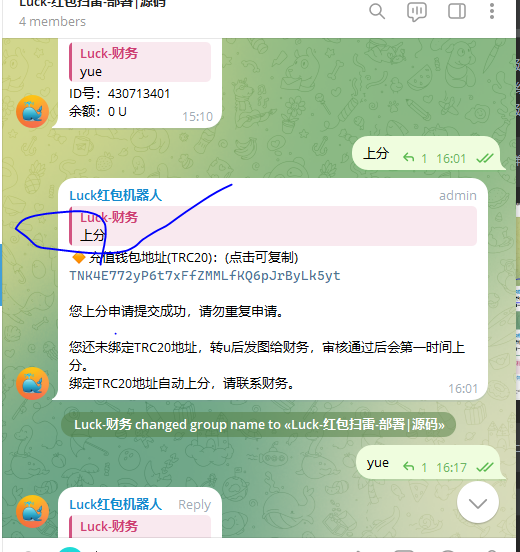
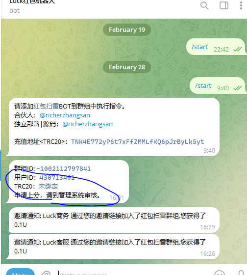

## 项目简介

本项目是一款基于virtualThread+kotlin+micronaut+telegram开发的红包机器人。 可以自定义添加机器人到群组。

目前处于开发阶段，请勿应用于实际的生产环境。

````
5. 群组内，初始化管理员
````


````
6. 上分
````





````
游戏指令：
    上分      上分申请-根据USDT转账金额上分
    下分100   下分申请
    yue 余额  查询余额
    100/1 100-1 发红包
````
更多 [部署|合作] 请点击TG入群，联系我。

https://t.me/luckhongbao

### 已知待处理问题列表

1. messageId问题
2. 抢红包引入队列
3. 数据存储引入redis
4. 红包雨🧧(财务发放)

#### 联系我
如果您有任何问题或建议，请随时联系我。您可以通过以下方式与我联系：
- https://t.me/luck_caiwu
- 如果有全职工作，也请联系我。

#### 开发进度可能比较慢。
